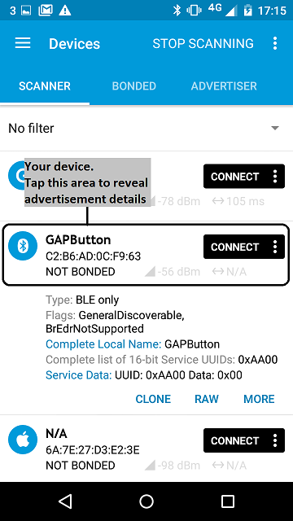
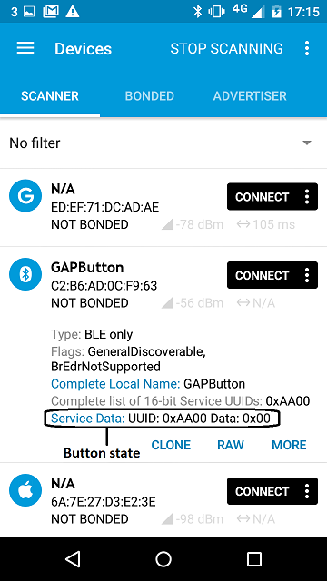
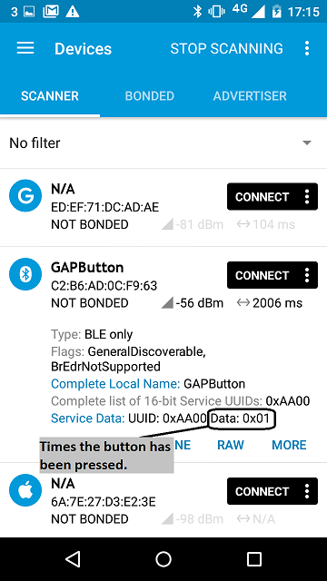
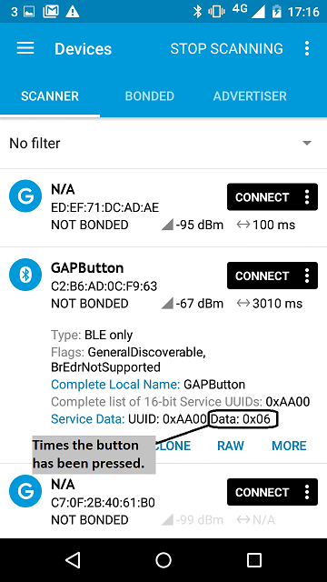

# Button count over GAP

This application shows how to use GAP to transmit a simple value to disconnected peer listening for advertisement every time that a value is updated:

1. The value is a count of how many times a button on the device was pressed (the code actually monitors the button's releases, not press downs).

1. We transmit the value in the SERVICE_DATA field of the advertising payload.

# Running the application

## Requirements

The sample application can be seen on any BLE scanner on a smartphone. If you don't have a scanner on your phone, please install :

- [nRF Master Control Panel](https://play.google.com/store/apps/details?id=no.nordicsemi.android.mcp) for Android.

- [LightBlue](https://itunes.apple.com/gb/app/lightblue-bluetooth-low-energy/id557428110?mt=8) for iPhone.

Hardware requirements are in the [main readme](https://github.com/ARMmbed/mbed-os-example-ble/blob/master/README.md).

### Porting this example on new boards

This example requires a board with at least a button to work. While the pin name of the button is defined for the `NRF51_DK`, `NRF52_DK`, `K64F` and `NUCLEO_F401RE`, it is not specified for other boards.

It is easy to add the button configuration for your board:
* Open the file named `mbed_app.json` at the root of this example.
* In the section `target_overides` add a new object named after your target if it doesn't exist. This object contain overridden parameters for your target.
* Override the property `ble_button_pin_name` in your target object. The value of the property should be equal to the pin name to use as a button.

As an example, this is the JSON bit which has to be added in the `target_overrides` section of `mbed_app.json` for a `NUCLEO_F411RE` board.

```json
        "NUCLEO_F411RE": {
            "ble_button_pin_name": "USER_BUTTON"
        }
```

<span> **Note:** You can get more informations about the configuration system in the [documentation](https://github.com/ARMmbed/mbed-os/blob/master/docs/config_system.md)</span>

<span> **Important:** If your target use an ST BLE shield, other parameters have to be overridden for your target. More information are available in the global [README](https://github.com/ARMmbed/mbed-os-example-ble/blob/master/README.md#targets-for-ble)</span>


## Building instructions

Building instructions for all samples are in the [main readme](https://github.com/ARMmbed/mbed-os-example-ble/blob/master/README.md).

## Checking for success

**Note:** Screens captures depicted below show what is expected from this example if the scanner used is *nRF Master Control Panel* version 4.0.5. If you encounter any difficulties consider trying another scanner or another version of nRF Master Control Panel. Alternative scanners may require reference to their manuals.

1. Build the application and install it on your board as explained in the building instructions.

1. Open the BLE scanner on your phone.

1. Start a scan.

    

    **figure 1** How to start scan using nRF Master Control Panel 4.0.5.

1. Find your device; it should be named `GAPButton`; and look at the advertisement broadcasted by your device (there is no need to connect to your device).

    

    **figure 2** Scan results using nRF Master Control Panel 4.0.5.

1. The Service Data field of the advertisement packet broadcasted by your device reflects the button press count. The starting value is 0.

    

    **figure 3** Initial state of the button using nRF Master Control Panel 4.0.5.

1. Press the button on the device.

    

    **figure 3** State after 1 button press using nRF Master Control Panel 4.0.5.

1. The Service Data field value of the advertisement packet should change every time you press the button.

    

    **figure 3** State after 6 button press using nRF Master Control Panel 4.0.5.

## Note

Since broadcasting is not reliable and your phone may scan intermittently, it is possible that your phone will miss button updates.
