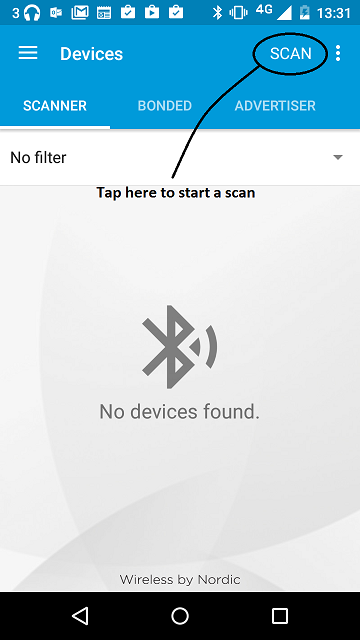
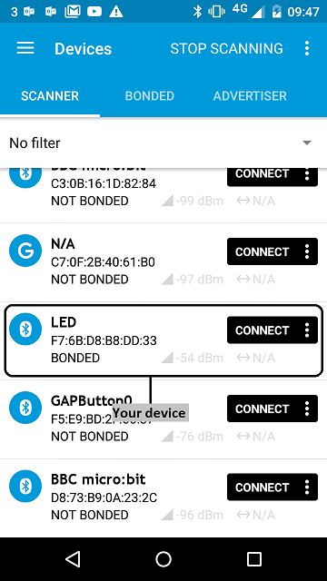
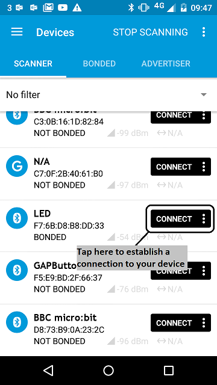
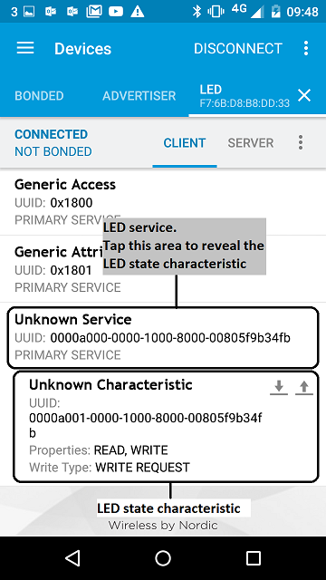
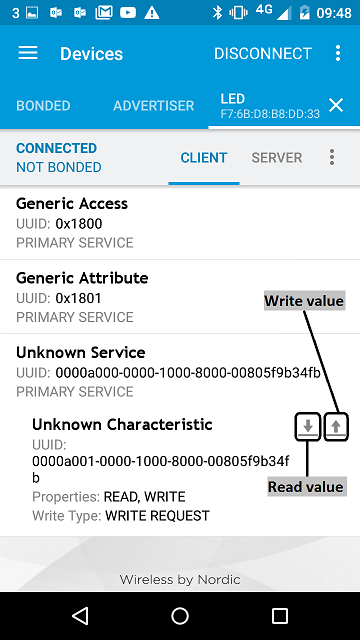
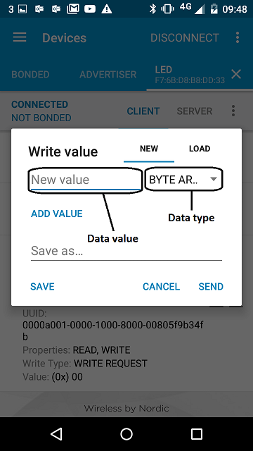
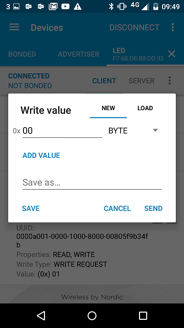
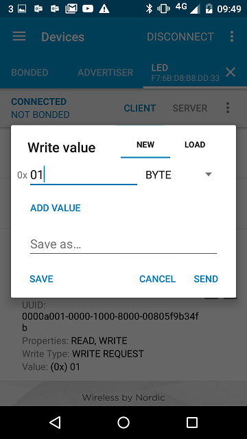

To help you create your own BLE services, we have created this service template.
The LED example demonstrates the use of a read-write characteristic to control a
LED through a phone app.

The template covers:

* Setting up advertising and connection states.
* Assigning UUIDs to the service and its characteristic.
* Creating an input characteristic: read-write, boolean. This characteristic offers control of the LED.
* Constructing a service class and adding it to the BLE stack.

# Running the application

## Requirements

The sample application can be seen on any BLE scanner on a smartphone. If you don't have a scanner on your phone, please install :

- [nRF Master Control Panel](https://play.google.com/store/apps/details?id=no.nordicsemi.android.mcp) for Android.

- [LightBlue](https://itunes.apple.com/gb/app/lightblue-bluetooth-low-energy/id557428110?mt=8) for iPhone.

Hardware requirements are in the [main readme](https://github.com/ARMmbed/mbed-os-example-ble/blob/master/README.md).

*NOTE:* If you have more than a single mbed board (e.g. nrf51dk or mkit) you can
run the BLE_LED and BLE_LEDBlinker at the same time. For more information please
refer to the BLE_LEDBlinker demo.

## Building instructions

Building instructions for all samples are in the [main readme](https://github.com/ARMmbed/mbed-os-example-ble/blob/master/README.md).

## Checking for success

**Note:** Screens captures depicted below show what is expected from this example if the scanner used is *nRF Master Control Panel* version 4.0.5. If you encounter any difficulties consider trying another scanner or another version of nRF Master Control Panel. Alternative scanners may require reference to their manuals.

1. Build the application and install it on your board as explained in the building instructions.
1. Open the BLE scanner on your phone.

1. Start a scan.

    

    **figure 1** How to start scan using nRF Master Control Panel 4.0.5

1. Find your device; it should be named `LED`.

    

    **figure 2** Scan results using nRF Master Control Panel 4.0.5

1. Establish a connection with your device.

    

    **figure 3**  How to establish a connection using Master Control Panel 4.0.5

1. Discover the services and the characteristics on the device. The *LED service* has the UUID `0xA000` and includes the *LED state characteristic* which has the UUID `0xA001`. Depending on your scanner, non standard 16-bit UUID's can be displayed as 128-bit UUID's. If it is the case the following format will be used: `0000XXXX-0000-1000-8000-00805F9B34FB` where `XXXX` is the hexadecimal representation of the 16-bit UUID value.

    

    **figure 4** Representation of the Led service using Master Control Panel 4.0.5

1. Open the write pannel of the *LED state* characteristic.

    

    **figure 5** How to read and write a characteristic value using Master Control Panel 4.0.5

1. The characteristic accept a 1 byte value:

    

    **figure 6** Write characteristic pannel using Master Control Panel 4.0.5

    * `0x00`: LED ON

        

        **figure 6** Write characteristic pannel to set the LED on using Master Control Panel 4.0.5

    * `0x01`: LED OFF

        

        **figure 6** Write characteristic pannel to set the LED off using Master Control Panel 4.0.5

1. Toggle the LED characteristic value and see the LED turn ON or turn OFF according to the value you set.

If you can see the characteristic, and the LED is turned on/off as you toggle its value, the application is working properly.
